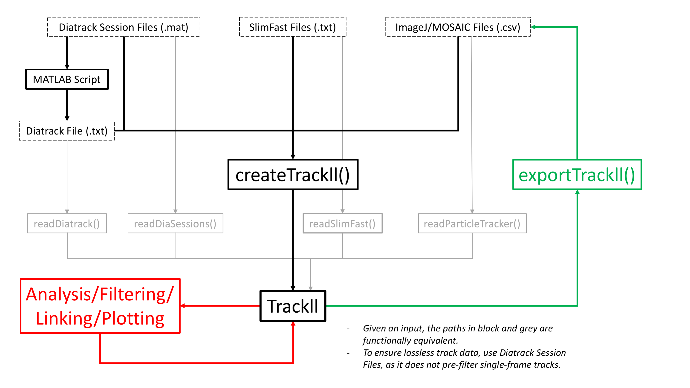

```{r setup, include=FALSE}
knitr::opts_chunk$set(echo = TRUE)
```

{width=90%}

# Reading Data

## `createTrackll()`

### Description
Take in Diatrack (.txt or .mat), ImageJ (.csv), SlimFast (.txt), or U-Track (.mat) input from a folder to output a list of track lists (`trackll`).

### Parameters

Parameter                            | Description
-------------------------------------|--------------------------------------------------------------------------------------------
`interact` (default `FALSE`)                 | Open interactive menu to choose the desired folder by selecting any file in it and select input type (script will process all files of that type in this folder).
`folder` (specify, unless interact = `TRUE`)| Full path output file folder (ensure each folder has files of only one input type).
`input` (specify, unless `interact = TRUE`) | Input file type (Diatrack .txt file = `1`; Diatrack .mat session file = `2`; ImageJ .csv file = `3`; SlimFast .txt file = `4`; Utrack .mat file = `5`).
`ab.track` (default `FALSE`)                 | Use absolute coordinates for tracks.
`cores` (default `1`)                    | Number of cores used for parallel computation. This can be the cores on a workstation, or on a cluster. Each core will be assigned to read one file when in parallel.
`frameRecord` (default `TRUE`)              | Add a fourth column to the track list after the $x$,$y$,$z$-coordinates for the frame that coordinate point was found (especially helpful when linking frames). Highly recommended to leave on.

### Notes

(When reading only Diatrack .mat session files (input = `2`), intensities will also be saved after the frame column)

It is highly advised that the frame record option be left on to preserve the most information, especially when linking frames. If the frame record option is turned on for reading Diatrack .txt files (`input = 1`), take note that the frame record is artificially created as consecutive frames after the given start frame. Otherwise, all other data types naturally encode the frames of every coordinate point.

The pre-censoring of single-frame tracks is dependent on the tracking software. For highest fidelity track data, use Diatrack (.mat) session files. If the initial creation of the trackll does not have a frame record, future exports and imports of the trackll will only preserve the start frames.

If the cores are set to the maximum number of cores available on the system, the script may return a error after processing all the files. This error is due to the requirement of some systems to have one core open for system functions. This error will not affect the trackll output, but to avoid it, one can input one less than the maximum number of cores available.

The naming scheme for the list of track list is as follows:

Track List: [full name of input file]

Track: [Last five characters of the file name].[Start frame].[Length].[Track].[Index in overall list (will differ from Track # when merging)]

(The last five characters of the file name, excluding the extension, cannot contain “.”)

### Aditional Information

* Using `createTrackll()` is equivalent to using `readDiatrack()`, `readDiaSessions()`, `readParticleTracker()`, and `readSlimFast()` with their corresponding input files.

* If the frame record in the fourth column needs to be deleted in a single track list, call `removeFrameRecord()` with the track list as the only input.

### Examples
```{r, eval=TRUE, messsage = FALSE, warning=FALSE, include=FALSE, echo=TRUE, results = 'hide'}
library(sojourner)
```


```{r, eval=TRUE, warning=FALSE, echo=TRUE, results = 'hold'}
# Designate a folder and then create trackll from DiaTrack .txt data
folder=system.file("extdata","SWR1_2",package="sojourner")
trackll = createTrackll(folder=folder, input=3)

# Alternatively, use interact to open file browser and select input data type
# trackll <- createTrackll(interact = TRUE)
```

Visualization using `plotNucTrackOverlay()`:

```{r, eval=TRUE, warning=FALSE, echo=FALSE, results = 'hide'}
# To visualize tracks over cell image
image_list = list.files(path=folder,pattern="_Nuclei.tif",full.names = TRUE)
.plotNucTrackOverlay(trackl = trackll[1], image.file = image_list[1])[[1]]
.plotNucTrackOverlay(trackl = trackll[2], image.file = image_list[2])[[1]]
```

# Processing Data

## `linkSkippedFrames()`

### Description
Link trajectories that skip (or do not appear for) a number of frames.

### Parameters

Parameter         | Description
------------------|--------------------------------------------------------------------------------------------
`trackll` (specify)   | A list of track lists.
`tolerance` (specify) | Distance tolerance level measured in pixels after the frame skip.
`maxSkip` (specify)   | Maximum number of frames a trajectory can skip.
`cores` (default `1`) | Number of cores used for parallel computation. This can be the cores on a workstation, or on a cluster. Tip: each core will be assigned to read in a file when paralleled.


### Notes
Given user input for a tolerance level to limit how far the next point after the skip can deviate from the last point in pixel distance and a maximum number of frame skips possible, all trajectories falling within these parameters are automatically linked, renamed, and ordered accordingly. For a `maxSkip` example, if the `maxSkip` for a trajectory ending in frame 7 was 3, the next linked trajectory can start up to a maximum frame of 11.

Although not required, in order for the output to have a frame record column (recommended), the input must have one as well.

The naming scheme for each linked track is as follows:

[Last five characters of the file name].[Start frame #].[Length].[Track #].[# of links]

Track List: [full name of input file]

Track: [Last five characters of the file name].[Start frame].[Length].[Track].[# of links].[Index in overall list (will differ from Track # when merging)]

(Note: The last five characters of the file name, excluding the extension, cannot contain “.”)

### Examples

```{r, eval=TRUE, warning=FALSE, echo = TRUE}
# Basic function call of linkSkippedFrames
trackll.linked <- linkSkippedFrames(trackll, tolerance = 5, maxSkip = 10)
```

Visualization using `plotNucTrackOverlay()`:

```{r, eval=TRUE, warning=FALSE, echo=FALSE, results = 'hide'}
# To visualize tracks over cell image
image_list = list.files(path=folder,pattern="_Nuclei.tif",full.names = TRUE)
.plotNucTrackOverlay(trackl = trackll.linked[1], image.file = image_list[1])[[1]]
.plotNucTrackOverlay(trackl = trackll.linked[2], image.file = image_list[2])[[1]]
```

## `filterTrack()`

### Description

Filter out tracks that have lengths within a specified range.

### Parameters

Parameter         | Description
------------------|--------------------------------------------------------------------------------------------
`trackll` (specify)   | A list of track lists.
`filter` (default `c(min=7,max=Inf)`) | Range of possible track lengths to keep.

### Examples

```{r, eval=TRUE, warning=FALSE, echo = TRUE}
trackll.filter=filterTrack(trackll ,filter=c(7,Inf))

# See the min and max length of the trackll
# trackLength() is a helper function output track length of trackll
lapply(trackLength(trackll),min)
lapply(trackLength(trackll.filter),min)
```

Visualization using `plotNucTrackOverlay()`:

```{r, eval=TRUE, warning=FALSE, echo=FALSE, results = 'hide'}
# To visualize tracks over cell image
image_list = list.files(path=folder,pattern="_Nuclei.tif",full.names = TRUE)
.plotNucTrackOverlay(trackl = trackll.filter[1], image.file = image_list[1])[[1]]
.plotNucTrackOverlay(trackl = trackll.filter[2], image.file = image_list[2])[[1]]
```


## `trimTrack()`

### Description

Trim tracks to a certain specified range of lengths.

### Parameters

Parameter         | Description
------------------|--------------------------------------------------------------------------------------------
`trackll` (specify)   | A list of track lists.
`trimmer` (default `c(min=1,max=32)`) | Range of track lengths allowed in output, otherwise trimmed.

### Examples

```{r, eval=TRUE, warning=FALSE, echo = TRUE}
trackll.trim=trimTrack(trackll,trimmer=c(1,20))

# See the min and max length of the trackll
# trackLength() is a helper function output track length of trackll
lapply(trackLength(trackll),max)
lapply(trackLength(trackll.trim),max)
```

Visualization using `plotNucTrackOverlay()`:

```{r, eval=TRUE, warning=FALSE, echo=FALSE, results = 'hide'}
# To visualize tracks over cell image
image_list = list.files(path=folder,pattern="_Nuclei.tif",full.names = TRUE)
.plotNucTrackOverlay(trackl = trackll.trim[1], image.file = image_list[1])[[1]]
.plotNucTrackOverlay(trackl = trackll.trim[2], image.file = image_list[2])[[1]]
```


## `maskTracks()`

### Description
Apply binary image masks.

### Parameters

Parameter         | Description
------------------|--------------------------------------------------------------------------------------------
`folder` (specify) | Full path to the output files.
`trackll` (specify)   | A list of track lists.

### Notes

IMPORTANT: It will take an extremely long time to mask large datasets. Filter/trim first using `filterTrack()` and `trimTrack()`, then mask using `maskTracks()`! Note the mask file should have the same name as the output files with a "_MASK.tif" ending. If there are more mask files than `trackll`, masking will fail. If there are less mask files, `trackl`s without masks will be deleted. Users can use `plotMask()` and `plotTrackOverlay()` to see the mask and its effect on screening tracks.

### Examples

```{r, eval=TRUE, warning=FALSE, echo=TRUE}
# Basic masking with folder path with image masks
folder = system.file("extdata","ImageJ",package="sojourner")
trackll = createTrackll(folder, input = 3)
trackll.filter=filterTrack(trackll ,filter=c(7,Inf))
trackll.masked <- maskTracks(folder = folder, trackll = trackll.filter)

# Plot mask
mask.list=list.files(path=folder,pattern="_MASK.tif",full.names=TRUE)
plotMask(folder)
```

```{r, eval=TRUE, warning=FALSE, echo=TRUE, results = 'hide'}
# If nuclear image is available
plotNucTrackOverlay(folder=folder,trackll=trackll)
plotNucTrackOverlay(folder=folder,trackll=trackll.masked)
```

## `mergeTracks()`

### Description
Merge a list of track lists into one.

### Parameters

Parameter         | Description
------------------|--------------------------------------------------------------------------------------------
`folder` (specify) | Full path to the output files.
`trackll` (specify)   | A list of track lists.

### Notes

IMPORTANT: Once a `trackll` has been merged, it cannot be masked using `maskTracks()`.

Merging creates the following data structure: (1) first level is the folder name, (2) second level is a list of `data.frames`/tracks from all output files merged into one.

If not merged, track lists takes the name of individual files in the folder. If merged, the single merged track list takes the folder name.


### Examples

```{r, eval=TRUE, warning=FALSE, echo=TRUE}
# Read data
folder=system.file("extdata","SWR1_2",package="sojourner")
trackll = createTrackll(folder=folder, input=3)

# Basic masking with folder path with image masks
trackll.merged <- mergeTracks(folder = folder, trackll = trackll)
```

# Exporting Data

## `exportTrackll()`

### Description
Take in a list of track lists (`trackll`) and export it into row-wise (ImageJ/MOSAIC) .csv files in the working directory.

### Parameters

Parameter         | Description
------------------|--------------------------------------------------------------------------------------------
`trackll`          | A list of track lists.
`cores` (default 1) | Number of cores used for parallel computation. This can be the cores on a workstation, or on a cluster. Tip: each core will be assigned to read in a file when paralleled.


### Notes
The reason why ImageJ/MOSAIC style .csv export was chosen is because it fully preserves track frame data, while maintaining short computation time and easy readability in Excel/etc.

In order to import this .csv export back into a trackll at any point (while preserving all information), select `input = 3` in `createTrackll()`.

If the track list does not have a fourth frame record column (not recommended), it will just output the start frame of each track instead and will take noticeably longer.

It is not recommended that exportTrackll be run on merged list of track lists (`trackll`). Also, ensure that the input trackll is a list of track lists and not just a track list.

The naming scheme for each export is as follows:

[yy-MM-dd]_[HH-mm-ss]_[Last five characters of the file name].csv

### Examples

```{r, eval=FALSE}
#Basic function call to exportTrackll with 2 cores into current directory
exportTrackll(trackll, cores = 2)

#Export one track list
.exportRowWise(trackll[[1]])

#Get current working directory
getwd()

#Import export save back into a trackll
trackll.2 <- createTrackll(folder = getwd(), input = 3, cores = 2)
```
