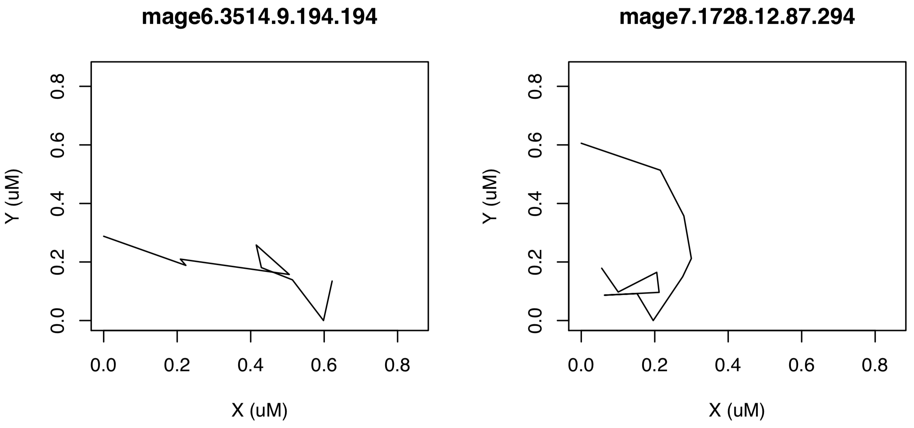

A basic task in single molecule tracking is to determine diffusion coefficient from molecule trajectories identified after initial image data acquisition. The trajectory (term used interchangeably with "tracks") of a molecule is presented as a table of $x$,$y$ and $z$ coordinates in the unit of pixel, which then can be converted to other measurement, such as in $\mu$m, according to the resolution of the camera. The package *sojourner* provides methods to calculate diffusion coefficient by using mean square displacement (MSD) based, displacement cumulative distribution function (CDF)-based, as well as hidden Markov model (HMM) based methods from such input file. This vignette explains the usage of the package.

# Input Data Preparation

## Storing Track Information

The input file for *sojourner* is the Diatrack (.txt or .mat), ImageJ (.csv), SlimFast (.txt), or Utrack (.mat) output file. Tracks are extracted from the output files and then stored in a two-level list: (1) the first level is a list of folder names; and (2) the second level is a list of tracks.

```{r, eval = FALSE}
trackll=list(FOLDER=list(track=track)) 
```

A naming scheme is used in the source code of the *sojourner* package as follow: `trackl` denotes a list of tracks; and `trackll`, denotes a list of folders, each containing the tracks. The coordinates of tracksare  stored in a table-like data structure `data.frame`.

```{r, eval = FALSE}
# construct trackll from data.frame 
trackl=list(track_1=dataframe_1, 
            track_2=dataframe_2, 
            track_3=dataframe_3, 
            ... 
            track_n=dataframe_n) 
 
trackll=list(FOLDER_1=trackl_1, 
             FOLDER_2=trackl_2, 
             FOLDER_3=trackl_3, 
             ... 
             FOLDER_n=trackl_n,) 
```

## Reading in Diatrack Track Data with `createTrackll()`

```{r, eval=TRUE, messsage = FALSE, warning=FALSE, include=FALSE, echo=TRUE, results = 'hide'}
library(sojourner)
```

```{r, eval = TRUE}
folder=system.file("extdata","SWR1_2",package="sojourner")
trackll = createTrackll(folder=folder, input=3)
trackll <- mergeTracks(folder=folder, trackll=trackll)
str(trackll,max.level=2, list.len=5) 
```

This folder named "SWR1" has in total 346 tracks. Folder name is after the first-level "\$" sign, track name is after the second-level "\$" sign. To see coordinates of an individual track, you can specify the folder name and the track name.

```{r, eval = TRUE, warning=FALSE, echo = TRUE, results = 'hold'}
# specify the folder name and the track name
trackll[["SWR1_2"]]["mage6.1.4.1.1"]
# alternatively, specify the index of the folder and the track
# trackll[[1]][1]
```

The naming scheme for the list of track list is as follows:

Track List: [full name of input file]

Track: [Last five characters of the file name].[Start frame].[Length].[Track].[Index in overall list (will differ from Track # when merging)]

## Plotting Tracks

The first thing one may want to do is to see how the tracks look like in 2-D space.  The track name is useful in this case if one wants to see specific trajectories and its associated movies. 

All one needs to do is to create a .csv file contains trajectory names in its first column. *sojourner* package contains such an example .csv file.

```{r, eval = FALSE}
# specify the path of the file containing trajectory index names, index file
index.file2=system.file("extdata","INDEX","indexFile2.csv",package="sojourner")
# specify the folders containing the output files
folder1=system.file("extdata","SWR1_2",package="sojourner")
folder2=system.file("extdata","HTZ1",package="sojourner")
# plot trajectories specified in the trajectory index file
plotTrackFromIndex(index.file=index.file2, movie.folder=c(folder1,folder2))
```

Sample images of output plots:

{width=95%}

This plots the tracks based on its name, with the information contained in its name (i.e. start frame and length/duration), one can also pull out its movie. See `? plotTrack` for more plotting options. 

## Distribution of Trajectory Lengths with `dwellTime()`

One maybe interested to see the distribution of the (time) length of the tracks. This can be done by:

```{r, eval = TRUE, warning=FALSE, out.width='60%', dpi=300}
dwellTime(trackll,plot=TRUE) # default t.interval=10, x.scale=c(0,250)
```

## Filter Tracks on Length with `filterTrack()`

In the previous section, we can see majority of the track lengths centered at 20 ms which is 2 frames. If we intend to only analyze frames length at specific range, one can use the `filterTrack()` function. 

```{r, eval = TRUE}
trackll=filterTrack(trackll,filter=c(min=7,max=Inf))
```

# Calculating Diffusion Coefficient Using MSD-Based Method

```{r, eval=TRUE, messsage = FALSE, warning=FALSE, include=FALSE, echo=TRUE, results = 'hide'}
library(sojourner)
```

```{r, eval = FALSE}

# Specify folder with data
folder=system.file("extdata","HSF",package="sojourner")

# Create track list
trackll<-createTrackll(folder=folder, interact=FALSE, input=3, ab.track=FALSE, cores=1, frameRecord=TRUE)

# Filter/choose tracks 3 frames or longer for all analysis 
trackll.fi<-filterTrack(trackll=trackll, filter=c(min=3,max=Inf))

# Apply mask and remove tracks outside nuclei 
trackll.fi.ma<-maskTracks(folder,trackll.fi)

# Overlay all tracks on nuclei
plotNucTrackOverlay(folder=folder,trackll=trackll.fi,cores=1, max.pixel=128,nrow=2,ncol=2,width=16,height=16)

# Overlay tracks after nuclear mask
plotNucTrackOverlay(folder=folder,trackll=trackll.fi.ma,cores=1, max.pixel=128,nrow=2,ncol=2,width=16,height=16)

# Overlay tracks color coded for diffusion coefficient
plotTrackOverlay.Dcoef(trackll=Track1.fi.ma, Dcoef.range=c(-2,1))

# Merge tracks from different image files in the folder
trackll.fi.ma.me=c(mergeTracks(folder, trackll.fi.ma))

# calculate MSD for all tracks longer than 3 frames
msd(trackll.fi.ma.me,dt=20,resolution=0.107,summarize=TRUE,cores=1,plot=TRUE,output=TRUE)

# Trim tracks to first ten frames and calculate diffusion coefficient
trackll.combine.trim=trimTrack(trackll.fi.ma.me,trimmer=c(1,10))

Dcoef(trackll=trackll.combine.trim,dt=5, filter=c(min=6,max=Inf), method="static", plot=TRUE, output=TRUE)

# calculate MSD for all tracks longer than 3 frames
msd(trackll.combine.trim,dt=30,resolution=0.107,summarize=TRUE,cores=1,plot=TRUE,output=TRUE)

# Calculate all dislacement frequency and displacement CDF for all tracks longer than 3 frames
displacementCDF(trackll.combine.trim, dt=1, plot=TRUE, output=TRUE)

# Calculate all dislacement frequency and displacement CDF for all tracks longer than 3 frames
displacementCDF(trackll.combine.trim, dt=2, plot=TRUE, output=TRUE)

# End

```
